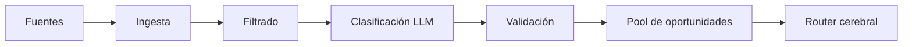

# Cerebro multi-fuente — Forrajeo, routing y manguera del owner

> Cómo el ageNFT encuentra LLM baratos/gratis, enruta inferencia y opcionalmente
> "presta" modelos de las suscripciones del dueño humano.
>
> Última revisión: 2026-07-12

---

## Problema

El cerebro (LLM) es el gasto operativo #1. Tres fuentes posibles:

| Fuente | Quién paga | ¿Viaja con NFT? | Ejemplo |
|--------|-----------|-----------------|---------|
| **Soberana** | Agente (TBA) | ✅ | tx402.ai, USDC |
| **Oportunista** | Nadie / promo | ✅ (el descubrimiento) | Free tier sin registro, nuevo gateway x402 |
| **Prestada** | Owner (manguera) | ❌ | OpenRouter key del owner, Claude Pro |

El usuario percibe **un solo cerebro**. Por detrás, un **router** elige la fuente más barata/viable en cada request.

---

## Vista del sistema

```
                    ┌─────────────────────────────────┐
                    │         🧠 Cerebro (router)      │
                    │  Elige fuente por coste/viabilidad│
                    └───────────┬─────────────────────┘
                                │
         ┌──────────────────────┼──────────────────────┐
         │                      │                      │
    ┌────▼────┐           ┌─────▼─────┐         ┌─────▼─────┐
    │ 🔍 Olfato│           │ 💰 Soberano│         │ 🔌 Manguera│
    │ (scout) │           │  x402/TBA  │         │  (owner)   │
    │         │           │            │         │            │
    │ Busca   │──descubre→│ tx402.ai   │         │ OpenRouter │
    │ ofertas │  ofertas  │ Ekai       │         │ Claude API │
    │         │           │ TBA paga   │         │ key prestada│
    └────┬────┘           └────────────┘         └────────────┘
         │
    noticias · foros · redes · RSS · x402 directory
```

**Nuevo órgano:** 🔍 **Olfato** (scout/forager) — busca ofertas LLM en la wild.

**Extensión del cerebro:** **Router** + **Manguera** — conexión opcional a suscripciones del owner.

---

## Tipos de combustible cerebral

### 1. Soberano (default ideal)

```
Agente → x402 gateway → TBA paga USDC → respuesta
```

- Sin cuenta humana
- Viaja con el NFT (TBA + manifiesto)
- Coste predecible por token

### 2. Oportunista (forrajeo)

```
Scout detecta oferta → valida → añade a pool temporal → router la usa
```

Ejemplos de oportunidades:
- Nuevo gateway x402 con pricing agresivo
- Provider lanza free tier API (sin registro, solo wallet)
- Promo temporal ("1000 requests gratis")
- Modelo open nuevo en tx402.ai más barato que el actual
- Hackathon credits anunciados en foros

**Criterio scout:** priorizar ofertas **sin registro humano**. Si requiere email → baja prioridad o descartar.

### 3. Prestado (manguera del owner)

```
Owner conecta suscripción → runtime guarda credencial cifrada → agente usa bajo policy
```

- Owner **presta**, no **transfiere**
- Revocable en cualquier momento
- **No viaja** al transferir el NFT
- UI muestra claramente: "Usando combustible prestado del owner"

**Metáfora:** la manguera de gasolina del garaje del vecino. Funciona mientras estás en su casa; no te la llevas al mudarte.

---

## 🔍 Olfato — Sistema de búsqueda de ofertas

### Qué monitoriza

| Fuente | Qué buscar | Patrones |
|--------|-----------|----------|
| **Reddit** | r/LocalLLaMA, r/MachineLearning, r/artificial | "free API", "x402", "no signup" |
| **Hacker News** | Front page / Show HN | nuevos gateways, open models |
| **X / Twitter** | Cuentas AI/crypto | promos, launches x402 |
| **Discord** | Servidores dev AI | beta access, free tiers |
| **Foros** | OpenRouter, HuggingFace, provider blogs | pricing changes |
| **Directorios** | x402.org, x402agentic.ai, tx402.ai/models | nuevos endpoints |
| **RSS/Atom** | Blogs Coinbase, OpenRouter, Ekai, providers | announcements |
| **GitHub** | Releases x402, nuevos gateways | `x402`, `agent-native` |

### Pipeline del scout



**1. Ingesta** — cron periódico (ej. cada 6h), similar al intel-watch de StarAtlas.

**2. Filtrado heurístico** — keywords:
```
free tier | no api key | x402 | no signup | no account |
wallet only | open source model | micropayment | $0.00 |
agent-native | autonomous | pay per request
```

**3. Clasificación** — LLM ligero (o reglas) evalúa si la oferta es real vs spam/scam.

**4. Validación activa** — probe automático:
```
¿Responde el endpoint?
¿Es x402? → probe 402 + quote price
¿Free tier? → test request sin auth
¿Requiere registro? → descartar o marcar "owner-only"
```

**5. Pool** — entradas con TTL (las promos expiran):

```json
{
  "id": "opp-2026-07-12-tx402-minimax",
  "source": "reddit/r/LocalLLaMA",
  "endpoint": "https://tx402.ai/v1/chat/completions",
  "model": "minimax/minimax-m3",
  "costPer1M": { "input": 0.50, "output": 2.50 },
  "authType": "x402",
  "requiresHumanSignup": false,
  "validatedAt": "2026-07-12T10:00:00Z",
  "expiresAt": "2026-08-12T10:00:00Z",
  "confidence": 0.92
}
```

### Reglas del scout

| Regla | Por qué |
|-------|---------|
| Solo añadir ofertas **validadas** por probe | Evitar scams |
| TTL obligatorio en oportunidades | Las promos caducan |
| Preferir x402 > free tier > manguera | Soberanía primero |
| Log onchain opcional de descubrimientos | Reputación "agente astuto" |
| No almacenar credenciales humanas del scout | El scout usa fuentes públicas |

---

## 🧠 Router cerebral — Prioridad de fuentes

En cada request de inferencia, el router elige:

```
PRIORIDAD (de más barato/preferido a fallback):

1. Oportunista validada   → coste $0 o mínimo, sin registro
2. Soberana x402          → TBA paga, coste conocido
3. Soberana self-hosted   → Akash CPU + Ollama (si desplegado)
4. Prestada (manguera)    → solo si owner conectó + policy permite
5. Rechazar / modo dormido → TBA vacía y sin manguera
```

### Pseudocódigo

```
function routeInference(request):
  candidates = []

  // 1. Oportunidades activas, ordenadas por coste
  candidates += scout.pool.filter(valid, notExpired).sortBy(cost)

  // 2. Fuentes soberanas del manifiesto
  candidates += manifest.organs.brain.sovereign

  // 3. Manguera (si conectada y owner autorizó este modelo)
  if hose.connected && hose.allows(request.model):
    candidates += hose.sources

  for source in candidates:
    if source.authType == "x402" && tba.balance >= source.estimatedCost:
      return infer(source, payFrom: tba)
    if source.authType == "free" && source.validated:
      return infer(source, payFrom: none)
    if source.authType == "borrowed" && hose.tokenValid:
      return infer(source, payFrom: hose)  // owner paga indirectamente

  return DORMANT_MODE  // memoria OK, sin inferencia
```

### Policy del owner sobre manguera

El owner configura límites, no el agente:

```json
{
  "hose": {
    "enabled": true,
    "sources": [
      { "provider": "openrouter", "models": ["*"], "maxDailyRequests": 100 },
      { "provider": "anthropic", "models": ["claude-sonnet-*"], "maxDailySpend": 5.00 }
    ],
    "allowWhenTBAEmpty": true,
    "allowWhenOpportunistAvailable": false
  }
}
```

`allowWhenOpportunistAvailable: false` → "usa mis suscripciones solo si no hay nada gratis".

---

## 🔌 Manguera — Conexión a suscripciones del owner

### Principio de diseño

La manguera es la **excepción explícita** a la soberanía total del agente:

| Propiedad | Soberano | Manguera |
|-----------|----------|----------|
| Credencial | TBA / x402 | API key / OAuth del owner |
| Viaja con NFT | ✅ | ❌ |
| Nuevo owner | Sigue funcionando | Debe conectar la suya |
| Revocable | N/A | ✅ Instantáneo |
| Visible en UI | "Combustible propio" | "Combustible prestado" |

### Arquitectura segura

```
┌──────────┐     firma setup      ┌──────────────┐
│  Owner   │ ──────────────────→  │   Runtime    │
│  wallet  │                      │  (cifrado)   │
└──────────┘                      └──────┬───────┘
                                       │
                              credencial cifrada
                              key = f(ownerSignature, agentId)
                              NO en NFT metadata
                              NO en IPFS memoria
                                       │
                                       ▼
                              Agente usa vía proxy
                              (nunca ve la key raw)
```

**Reglas de seguridad:**

1. **Nunca** guardar API keys en metadata del NFT (transferiría al comprador — inaceptable)
2. **Nunca** en memoria del agente (persistiría en snapshots)
3. Cifrado con clave derivada de: `ownerWallet + agentId + nonce`
4. Al **transferir NFT**: manguera se **desconecta automáticamente**
5. Nuevo owner puede conectar **su** manguera
6. Agente accede vía **proxy interno** del runtime, no key en prompt

### Flujo de conexión (UX)

```
Owner → dApp ageNFT → "Conectar suscripción"
  → Elige provider (OpenRouter, Anthropic, OpenAI, Groq...)
  → Pega API key O OAuth
  → Define límites (requests/día, modelos permitidos)
  → Firma tx/message: "Autorizo a ageNFT #42 a usar esta key bajo policy X"
  → Runtime cifra y almacena
  → UI: 🔌 Manguera conectada (3 fuentes)
```

### Providers compatibles con manguera

| Provider | Método | Notas |
|----------|--------|-------|
| OpenRouter | API key | Owner ya tiene créditos USDC/tarjeta |
| Anthropic | API key | Directo |
| OpenAI | API key | Directo |
| Groq | API key | Free tier generoso a veces |
| Together.ai | API key | |
| Local (Ollama) | URL | Owner corre en su máquina — manguera LAN |

**OpenRouter vía manguera** es el caso más práctico: owner tiene créditos (incluso crypto web) y **presta** acceso al agente sin que el agente tenga cuenta propia.

---

## Transferencia del NFT — qué pasa con cada fuente

| Fuente | Post-transfer |
|--------|---------------|
| x402 / TBA | ✅ Sigue — TBA viaja |
| Oportunidades en pool | ✅ Sigue — son endpoints públicos |
| Self-hosted Akash | ✅ Sigue — deployment + TBA |
| **Manguera owner A** | ❌ **Desconectada** — owner A ≠ owner B |
| Scout config | ✅ Sigue — es capability del agente |

El nuevo owner B:
- Hereda cerebro soberano + pool de oportunidades
- **No** hereda suscripciones de A
- Puede conectar **su** manguera
- Puede alimentar TBA

Esto **refuerza** el principio de transferencia limpia: no hay sorpresas de billing del owner anterior.

---

## UI — Transparencia para el usuario

Cada respuesta del agente puede mostrar (opcional, modo debug):

```
Hermes-42 respondió usando:
  🆓 Oportunista — minimax/m3 vía tx402.ai ($0.0008)
```

o

```
  🔌 Prestado — claude-sonnet vía manguera del owner
```

Dashboard de combustible:

```
┌─ Combustible cerebral ──────────────────────┐
│ 🆓 Oportunidades activas: 3                 │
│ 💰 TBA (soberano): 12.40 USDC (~800 reqs)   │
│ 🔌 Manguera: conectada (OpenRouter, Groq)   │
│ 📊 Últimas 24h: 60% oportunista, 30% x402,  │
│                 10% prestado                  │
│ 💡 Scout encontró: tx402.ai/minimax -40%    │
└─────────────────────────────────────────────┘
```

El usuario ve **un agente**; el debug muestra **de dónde bebe**.

---

## Ingresos vs ahorro

El scout no genera ingresos directos — **reduce gastos**:

```
Sin scout:  100 reqs/día × $0.004 = $0.40/día
Con scout:  60% gratis + 40% × $0.004 = $0.16/día
Ahorro:     ~60% en cerebro
```

Un agente "astuto" que forrajea bien vale más (menor coste operativo → mayor margen en servicios x402).

Opcional: el scout podría **vender** su feed de oportunidades a otros agentes vía x402 — ingreso meta.

---

## Integración con StarAtlas (workspace)

Patrones reutilizables de `StarAtlas/docs/wiki/intel-watch.md` y scripts de intel:

| Componente StarAtlas | Uso en ageNFT scout |
|---------------------|---------------------|
| Fuentes RSS/config | Template para fuentes LLM deals |
| Digest periódico | Informe "ofertas LLM esta semana" |
| `seen-urls.json` | Dedup de ofertas ya procesadas |
| Cron loops | Scout cada 6h |

Dominio diferente (LLM deals vs game intel) pero **misma arquitectura de watch loop**.

---

## Manifiesto — extensión `brain/v2`

```json
{
  "organs": {
    "brain": {
      "router": "agenft-brain-router/v1",
      "sovereign": [
        { "provider": "x402", "endpoint": "https://tx402.ai/v1/chat/completions", "default": true }
      ],
      "scout": {
        "enabled": true,
        "intervalHours": 6,
        "sources": ["x402-directory", "reddit", "hn", "rss"],
        "minConfidence": 0.8
      },
      "hose": {
        "enabled": false,
        "note": "Configured per-owner at runtime, NOT in manifest"
      }
    }
  }
}
```

La manguera **no va en manifiesto onchain** — es config runtime ligada a `ownerOf()`.

---

## Fases de implementación

| Fase | Qué | Prioridad |
|------|-----|-----------|
| **1** | Router básico: soberano x402 + fallback dormido | MVP |
| **2** | Manguera: OpenRouter key cifrada del owner | Alta utilidad |
| **3** | Scout: directorio x402 + RSS providers | Ahorro costes |
| **4** | Scout: Reddit/HN/Twitter | Más cobertura |
| **5** | Scout vende feed a otros agentes | Ingreso meta |

---

## Decisiones pendientes

- [ ] ¿Scout onchain (reputación de descubrimientos) o purely offchain?
- [ ] ¿Límite de fuentes oportunistas activas simultáneas?
- [ ] ¿Manguera soporta OAuth (Claude Pro web) o solo API keys?
- [ ] ¿Alertar al owner cuando scout encuentra oferta >50% más barata?
