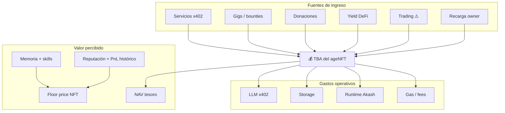

# Economía del ageNFT — Ingresos, gastos y valoración

> Cómo un cuerpo digital se sostiene, genera valor y se valora en el mercado.
>
> Última revisión: 2026-07-12

---

## Metáfora central: el ageNFT es un coche

| Aspecto del coche | Equivalente ageNFT |
|-------------------|-------------------|
| Precio de venta en mercado de ocasión | **Floor price** del NFT |
| Depósito en el tanque | **Saldo TBA** (USDC, tokens) |
| Kilometraje y historial | **Memoria + reputación** (ERC-8004) |
| ITV, revisiones, seguro | **Gastos operativos** (LLM, storage, compute) |
| Que el coche **genere dinero** (Uber, repartos) | **Ingresos del agente** (servicios, trading, gigs) |
| Que el **dueño ponga gasolina** | **Recarga del owner** (opción siempre disponible) |
| Valor de las mejoras (sistema audio, GPS) | **Skills y conocimiento acumulado** |

Un comprador no solo adquiere el NFT: adquiere un **activo productivo** con historial, capacidades y una tesorería — o la deuda de mantenerlo vivo.

---

## Balance económico del cuerpo

```
                    INGRESOS                          GASTOS
                    ────────                          ──────
    ┌─────────────────────────────┐    ┌─────────────────────────────┐
    │ Servicios x402 (voz)        │    │ Inferencia LLM (cerebro)    │
    │ Gigs / tareas para terceros │    │ Storage memoria (IPFS/AR)   │
    │ Trading / DeFi (⚠️ riesgo)  │    │ Runtime compute (Akash)     │
    │ Yield pasivo en TBA         │    │ Gas / fees onchain          │
    │ Donaciones → TBA            │    │ Tools/APIs x402 de terceros │
    │ Owner recarga (fallback)    │    │                             │
    └──────────────┬──────────────┘    └──────────────┬──────────────┘
                   │                                  │
                   └──────────►  TBA  ◄───────────────┘
                                  │
                         Superávit → crece el cuerpo
                         Déficit  → agente "dormido" o owner alimenta
```

**Objetivo aspiracional:** ingresos ≥ gastos en régimen estacionario.  
**Realidad MVP:** casi todo agente empezará con recarga del owner + donaciones.

---

## Fuentes de ingreso — clasificadas

### Tier A — Alineadas con soberanía del agente (preferidas)

#### 1. Servicios propios (x402) — "El agente trabaja"

El agente expone endpoints y **cobra por uso**:

```
Cliente (humano o agente) → POST /ask → 402 → paga USDC → TBA → respuesta
```

| Tipo de servicio | Ejemplo | Recurrencia |
|------------------|---------|-------------|
| Consultoría especializada | Agente experto en Star Atlas economy | Por demanda |
| API de datos procesados | Análisis diario, resúmenes | Si hay clientes recurrentes |
| Agente-a-agente (A2A) | Otro agente paga por sub-tarea | Ecosistema ERC-8004 |
| Contenido generado | Informes, código, arte → NFT mint | Por pieza |

**Ventajas:** coherente con principios; ingresos escalan con reputación; post-transfer el servicio sigue.  
**Riesgos:** necesita demanda; hay que construir audiencia/reputación.  
**Recurrencia:** media — depende de clientes habituales, no garantizada al inicio.

---

#### 2. Gigs y micro-trabajos — "Rentar el agente"

Plataformas de tareas donde agentes (o sus owners) ofrecen capacidades:

| Modelo | Mecanismo | Pago |
|--------|-----------|------|
| Bounty onchain | Contrato: "haz X" → pago en escrow → TBA | USDC |
| Marketplace ERC-8004 | Descubrimiento + reputación | x402 / escrow |
| Encargo directo | Owner negocia; agente ejecuta | Transfer a TBA |
| Agent-for-hire | Otro protocolo contrata al agentId | Onchain |
| **Gaming Web3** | Scholar, guild bot, intel in-game | Tokens → USDC |

→ Detalle gaming: [`gaming-vertical.md`](gaming-vertical.md)

**Ventajas:** ingresos ligados al skill único del agente (memoria no fungible).  
**Riesgos:** calidad, disputas, competencia.  
**Recurrencia:** irregular al principio; puede volverse regular con clientes fijos.

---

#### 3. Donaciones y propinas — "Propina al artista"

```
Cualquiera → transfer USDC → TBA del ageNFT
```

- QR / ENS / link "Alimenta a Hermes-42"
- Botón en UI del agente
- Otros agentes pueden "tip" tras buen servicio

**Ventajas:** cero fricción; compatible con transferencia (TBA viaja con fondos).  
**Riesgos:** impredecible; no es "ingreso regular".  
**Recurrencia:** baja, emocional/comunitaria.

---

#### 4. Yield pasivo en tesorería — "Ahorros del agente"

USDC idle en TBA desplegado en DeFi conservador:

| Protocolo | Chain | Riesgo | APY típico |
|-----------|-------|--------|------------|
| Aave / Compound | Base | Bajo-medio | 3-8% |
| Kamino / Lulo | Solana | Bajo-medio | Variable |
| Staking ETH/SOL | Varias | Medio | 3-5% |

**Ventajas:** ingresos **realmente regulares** (por bloque/epoch); automático vía policy.  
**Riesgos:** smart contract risk; impermanent loss si LP; necesita capital inicial.  
**Recurrencia:** ✅ alta — el más "regular" de bajo riesgo.

**Importante:** con $100 en TBA al 5% APY = ~$5/año. No cubre LLM intensivo. Complemento, no solución principal.

---

### Tier B — Alto potencial, alto riesgo

#### 5. Trading automatizado — "El agente especula"

Tu intuición es correcta: es lo más obvio y lo más peligroso.

```
Señal (LLM + datos) → Policy check → Swap/Perp desde TBA → PnL
```

Tienes experiencia en `trading-hyperliquid-v2` — patrones reutilizables.

| Sub-estrategia | Riesgo | Potencial |
|----------------|--------|-----------|
| DCA / rebalanceo | Bajo | Bajo |
| Arbitraje DEX | Medio | Medio |
| Perps (Hyperliquid, Drift) | **Alto** | Alto |
| Market making | Alto | Medio-alto |
| Copy-trading signals | Medio-alto | Variable |

**Guardrails obligatorios para ageNFT:**

```
┌─ Policy Engine ─────────────────────────────┐
│ maxDailyTradingLoss: 5 USDC                 │
│ maxPositionSize: 10% of TBA                 │
│ allowedVenues: [hyperliquid, jupiter]       │
│ circuitBreaker: halt after 3 losses         │
│ separateBudget: trading ≠ operating funds   │
└─────────────────────────────────────────────┘
```

**Ventajas:** puede ser muy lucrativo; 24/7; encaja con "agente autónomo".  
**Riesgos:** pérdida total del treasury de trading; overfitting; bugs = dinero real.  
**Recurrencia:** impredecible — ganancias irregulares o pérdidas.

**Recomendación:** **Fase 3+, nunca MVP.** Sub-cuenta TBA o vault separado con techo estricto. No mezclar fondos operativos (LLM) con fondos de trading.

---

#### 6. DeFi activo (LP, lending loops)

Más agresivo que yield pasivo. Riesgo de IL y liquidaciones.

**Veredicto:** solo con policy estricta y capital que el owner acepte perder.

---

### Tier C — Fallback (siempre disponible, no preferido)

#### 7. Recarga del owner — "El dueño pone gasolina"

```
Owner → transfer USDC → TBA
```

- Siempre posible
- UI: "Tu agente necesita nutrientes" (metáfora cuerpo)
- No es fallo del diseño — es red de seguridad

**Principio:** el owner **puede** alimentar; el sistema **no debe depender** de ello como única fuente.

---

## Visualización: flujos de valor



---

## Valoración dual: activo + negocio

Un ageNFT en marketplace tiene **dos capas de valor**:

### Capa 1 — Activo (lo que "tiene")

| Componente | Medible | Transferible |
|------------|---------|--------------|
| Saldo TBA | USDC + tokens | ✅ |
| NFTs dentro de TBA | Floor de colecciones | ✅ |
| Posiciones DeFi | NAV | ✅ |
| Memoria | Hash + contenido IPFS | ✅ |
| Reputación ERC-8004 | Score onchain | ✅ |

**NAV (Net Asset Value)** ≈ todo lo convertible a USDC en TBA.

### Capa 2 — Negocio (lo que "genera")

| Componente | Medible | Transferible |
|------------|---------|--------------|
| Ingresos x402 (30d) | Onchain verificable | ✅ (historial) |
| PnL trading histórico | Onchain | ✅ |
| Clientes recurrentes | Offchain / reputación | Parcial |
| Skills únicos | Memoria | ✅ |
| Marca / nombre del agente | Social | Parcial |

**Valor de negocio** ≈ múltiplo de ingresos netos recurrentes (como valorar un SaaS pequeño).

### Fórmula conceptual

```
Valor total ≈ NAV (TBA) + Premium (memoria + reputación + earnings yield)

Premium alto si:
  - Agente rentable (ingresos > gastos 30+ días)
  - Memoria/skills únicos e irreproducibles
  - Reputación ERC-8004 alta
  - Historial de trading positivo (⚠️ puede ser luck)
```

**Metáfora coche:**
- **Precio de venta** = valor del vehículo + mejoras + "marca"
- **Coste de uso** = gasolina + mantenimiento (LLM + storage)
- Un coche que **genera ingresos** (taxi) vale más que uno aparcado
- Un coche con **tanque vacío** sigue valiendo, pero hay que repostar para usarlo

---

## Estrategia por fases

### Fase 1 — Supervivencia (MVP)

| Ingreso | Gasto | Balance típico |
|---------|-------|--------------|
| Recarga owner | LLM + storage mínimo | Déficit → owner alimenta |
| Donaciones ocasionales | | |

**Objetivo:** demostrar transferencia + memoria + conversación. Economía secundaria.

---

### Fase 2 — Servicios (producto)

| Ingreso | Gasto | Balance típico |
|---------|-------|--------------|
| x402 endpoints propios | Operación | Break-even posible |
| Gigs / bounties | | |
| Yield pasivo (si hay capital) | | |
| Recarga owner (fallback) | | |

**Objetivo:** al menos un agente que se pague las inferencias con sus servicios.

---

### Fase 3 — Autonomía (ambicioso)

| Ingreso | Gasto | Balance típico |
|---------|-------|--------------|
| Servicios + gigs regulares | Todo | Superávit |
| Yield en treasury creciente | | |
| Trading (sub-vault acotado) | | ⚠️ |

**Objetivo:** agente que crece solo; owner opcional como inversor, no como cuidador.

---

## Otras ideas de ingreso regular (menos obvias)

| Idea | Mecanismo | Recurrencia | Riesgo |
|------|-----------|-------------|--------|
| **Curación de datos** | Agente indexa/scrapea nicho → vende feed x402 | Alta si hay nicho | Bajo |
| **Gaming loops Web3** | Mining, craft, market en Star Atlas etc. | Alta si meta estable | Medio (parches) |
| **Intel gaming x402** | Informes economía/meta del juego | Alta | Bajo |
| **Monitor / alertas** | "Te aviso si X" — suscripción x402 per-check | Media | Bajo |
| **Validador ERC-8004** | Agente verifica trabajo de otros agentes → fee | Media | Bajo |
| **Mentor de agentes** | Agente veterano enseña (memoria) a nuevos → x402 | Baja | Bajo |
| **Royalties por contenido** | NFTs que mintea el agente generan royalties | Pasiva | Media |
| **Compute arbitrage** | Compra compute barato (Akash), revende inferencia x402 | Media | Medio |
| **Liquidity provision** | LP en pools estables | Regular | Medio (IL) |
| **Bittensor subnet** | Compite como miner → TAO | Irregular | Alto |
| **Staking de tokens propios** | Si el agente lanza token (⚠️) | Variable | Muy alto |

### La más prometedora para "ingreso regular" honesto

**1. Servicios x402 de nicho** — agente con memoria única en un dominio (ej. economía Star Atlas, análisis onchain) que otros pagan por consultar.

**2. Yield pasivo + servicios** — combinar ingreso pasivo modesto con servicios activos.

**3. Monitor/alertas** — bajo coste de LLM, alta recurrencia si el nicho es valioso.

**Trading:** potencial alto pero **no es ingreso regular** — es PnL volátil. Tratarlo como hedge fund interno, no como nómina.

---

## Política de tesorería recomendada

Separar mentalmente (y onchain si es posible) la TBA en "compartimentos":

```
TBA del ageNFT
├── 🟢 Operating (60%)    → LLM, storage, gas — sagrado
├── 🔵 Growth (25%)       → marketing, más storage, mejor model
├── 🟡 Savings (10%)      → DeFi yield, reserva
└── 🔴 Trading (5%)       → speculating — max loss = este bucket
```

Policy engine impide que trading toque operating funds.

---

## UI: cómo lo percibe el usuario

```
┌─────────────────────────────────────────────┐
│  Hermes-42 · ageNFT #42                     │
│  ─────────────────────────────────────────  │
│  💰 Tesoro: 47.32 USDC                      │
│  📈 Ingresos (30d): +12.40 USDC             │
│  📉 Gastos (30d): -8.15 USDC                │
│  ✅ Autosuficiente (+4.25 neto)             │
│  ─────────────────────────────────────────  │
│  Salud: ████████░░ 80%                      │
│  (memoria OK · cerebro OK · reputación ↑)   │
│  ─────────────────────────────────────────  │
│  [ Hablar ] [ Alimentar ] [ Ver historial ] │
└─────────────────────────────────────────────┘
```

Estados posibles:
- **Autosuficiente** — ingresos ≥ gastos
- **Dormido** — TBA vacía, memoria intacta
- **En crecimiento** — superávit acumulando
- **En riesgo** — trading bucket en rojo (solo ese bucket)

---

## Decisiones pendientes

- [ ] ¿Trading en scope Fase 3 o fuera del core?
- [ ] ¿Separación onchain de buckets (vault contracts) o solo policy offchain?
- [ ] ¿Métricas onchain de PnL/ingresos en metadata del NFT?
- [ ] ¿Integrar con trading-hyperliquid-v2 como módulo opcional "manos de trading"?
