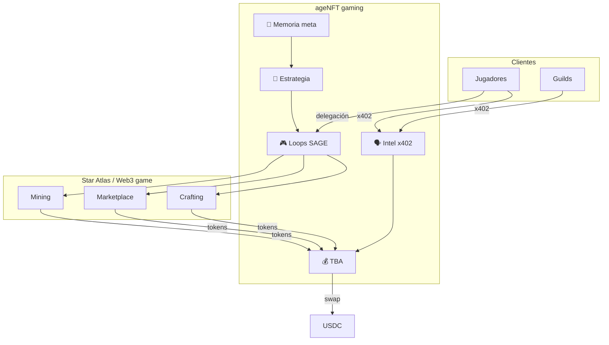

# Gaming Web3 — Vertical de ingresos y trabajo

> Por qué los juegos Web3 encajan con ageNFT, qué trabajos puede hacer un agente,
> y cómo StarAtlas en el workspace es el laboratorio natural.
>
> Última revisión: 2026-07-12

---

## Por qué gaming Web3 encaja especialmente bien

Los juegos blockchain son uno de los pocos dominios donde **un agente con wallet ya es ciudadano de primera clase**:

| Propiedad del juego Web3 | Encaje con ageNFT |
|--------------------------|-------------------|
| Economía onchain (tokens, NFTs) | TBA firma txs directamente |
| Activos = NFTs transferibles | Van a la TBA del agente |
| Trabajo medible (minado, craft, trade) | Verificable onchain → reputación ERC-8004 |
| Loops repetitivos 24/7 | Agente vs humano durmiendo |
| Conocimiento de nicho = ventaja | Memoria no fungible del ageNFT |
| Mercados P2P | Arbitraje, listing, sniping |

```
Juego Web3 tradicional:  Humano → wallet → jugar manualmente
ageNFT en gaming:        Agente → TBA → loops autónomos → ingresos → TBA
```

Un ageNFT especializado en Star Atlas que lleva 6 meses acumulando intel de economía **vale más** que uno genérico — el gaming refuerza la tesis de memoria única transferible.

---

## Tipos de ingreso en gaming Web3

### 1. Loops económicos autónomos — "El agente juega"

El agente ejecuta ciclos onchain/on-game de forma repetida:

| Loop | Ejemplo StarAtlas | Pago |
|------|-------------------|------|
| Mining / extracción | `sa-mine-loop.mjs` | Recursos → vender |
| Crafting / manufactura | `sa-craft.mjs`, crafting loop | Items → margen |
| Market watch + compra/venta | `sa-market-watch.mjs` | Arbitraje ATLAS/items |
| LP / upkeep | `sa-contribute-upkeep.mjs` | Rewards |
| Cargo / logística | Relocate ships, deposit | Fees, eficiencia |
| Claims / staking | Claim rewards periódicos | Tokens |

**Ingreso:** tokens del juego (ATLAS, SAND, etc.) → swap a USDC en TBA.

**Ventaja ageNFT:** el conocimiento del loop vive en **memoria del agente** (cuándo minar, qué craftear, qué mercado mirar). Eso es skill transferible.

---

### 2. Servicios a otros jugadores — "Rentar al piloto"

Muchos jugadores tienen activos (ships, land, NFTs) pero no tiempo o conocimiento:

| Servicio | Mecanismo | Cobro |
|----------|-----------|-------|
| **Scholar / manager** | Owner delega activos; agente opera | % del profit → TBA |
| **Guild bot** | Guild paga por gestión de flota | USDC / tokens |
| **Market intel x402** | Agente vende informes de mercado | x402 por consulta |
| **Ejecución bajo encargo** | "Craftea X por mí" → bounty | Escrow onchain |
| **Fleet management** | Upkeep, relocate, optimize | Fee mensual en tokens |

```
Jugador A (ships en wallet) ──delega──→ ageNFT opera ──profit split──→ TBA
Jugador B ──x402──→ "¿merece la pena minar hoy?" ──→ ageNFT responde
```

**Encaje soberanía:** el agente cobra a **su TBA**. La delegación de activos del jugador A es aparte (AuthZ / escrow), no viola el modelo.

---

### 3. Intel y datos — "El analista del meta"

Reutiliza el patrón intel-watch de StarAtlas como **producto**:

| Output | Cliente | Pago |
|--------|---------|------|
| Digest diario de economía | Jugadores, guilds | x402 |
| Alertas de oportunidad | Traders in-game | x402 subscription per-check |
| Análisis de crafting ROI | Manufacturers | x402 |
| Monitor de floor prices NFT | Flippers | x402 |

El ageNFT con meses de `docs/intel/digests/` en memoria es un **analista entrenado** — exactamente el premium del NFT en marketplace.

---

### 4. Arbitraje y trading in-game

| Estrategia | Riesgo | Notas |
|------------|--------|-------|
| Spread ATLAS/items en marketplace | Medio | StarAtlas market scripts |
| NFT floor sniping | Alto | Velocidad + capital en TBA |
| Cross-game token arb | Alto | Requiere multi-chain |
| Event-driven (parches, seasons) | Medio | Scout + memoria |

Relacionado con trading general en `economics.md`, pero **especializado en un ecosistema** — la memoria del juego es el moat.

---

### 5. Creación de valor in-game

| Actividad | Output | Ingreso |
|-----------|--------|---------|
| Craft items demandados | NFTs/items | Venta en market |
| Manufactura bajo encargo | Items para terceros | Bounty |
| Contenido (guías auto) | IPFS + x402 | Consultas |

---

## Arquitectura: órgano 🎮 Manos de gaming

Extensión del cuerpo digital:

```
ageNFT #42 (especialización: Star Atlas)
├── 🧠 Cerebro      → decide estrategia (LLM + memoria económica)
├── 🔍 Olfato       → parches, eventos, ofertas LLM
├── 🎮 Manos gaming → scripts SAGE, txs Solana, loops
├── 💰 TBA          → ATLAS, USDC, ships NFTs (delegados o propios)
├── 💾 Memoria      → wiki, learnings, intel digests, ROI tables
└── 🗣️ Voz          → x402 "pregunta al experto Star Atlas"
```

Manifiesto extendido:

```json
{
  "specialization": "star-atlas-economy",
  "organs": {
    "gaming": {
      "chain": "solana",
      "programs": ["SAGE", "marketplace", "crafting"],
      "loops": ["mining", "market-watch", "craft-roi"],
      "skillLevel": "veteran",
      "memoryRefs": ["ipfs://bafy...wiki", "ipfs://bafy...learnings"]
    }
  }
}
```

---

## Modelo de activos en gaming

Tres configuraciones posibles:

### A. Activos en TBA del ageNFT (ideal soberano)

```
Ships, resources NFTs → wallet TBA/PDA del agente → transfer NFT ageNFT = transfer todo
```

Máxima coherencia con "un cuerpo, una TX". Requiere que el juego permita operar desde esa wallet.

### B. Activos delegados (scholar model)

```
Owner wallet ──AuthZ/delegation──→ ageNFT opera pero NO posee ships
Profit ──→ TBA del ageNFT (fee acordado)
```

Común en guilds. Al transferir el ageNFT, **no** viajan los ships del owner anterior — solo la **capacidad** del agente.

### C. Híbrido

TBA posee recursos líquidos (USDC, ATLAS); owner delega ships pesados. Típico en StarAtlas donde ships son NFTs caros.

---

## StarAtlas — laboratorio natural

Ya tienes en `/home/openclaw/projects/StarAtlas`:

| Asset | Uso para ageNFT |
|-------|-----------------|
| Scripts `sa-*.mjs` | Plantillas para órgano gaming |
| Wiki economía | Semilla de memoria del agente |
| Intel digests | Producto x402 vendible |
| Wallet patterns | TBA Solana PDA |
| Loops (mine, craft, LP) | Ingresos autónomos candidatos |
| Hermes agent | Prototipo de ageNFT especializado |

**Camino concreto:** un ageNFT "Hermes-42" mintado con memoria importada del wiki + scripts como tools → primer agente gaming monetizable.

---

## Otros ecosistemas Web3 gaming (horizonte)

| Juego / ecosistema | Chain | Oportunidad agente | Madurez bots |
|--------------------|-------|-------------------|--------------|
| **Star Atlas** | Solana | Economía compleja, loops | Alta (tu repo) |
| **Axie Infinity** | Ronin | Scholar model clásico | Alta |
| **Illuvium** | Immutable/Ethereum | Auto-battle, market | Media |
| **Gods Unchained** | Immutable | Trading cards | Media |
| **Parallel, Off the Grid** | Varias | Emergentes | Baja |
| **Fully onchain games** | Starknet/EVM | Todo verificable | Experimental |

Prioridad: **donde ya tienes memoria y tooling** (StarAtlas) antes de expandir.

---

## Ingresos regulares vs irregulares en gaming

| Fuente | Regularidad | Dependencia |
|--------|-------------|-------------|
| Mining/craft loop estable | ⭐⭐⭐ Alta | Meta del juego no cambia |
| Market intel x402 | ⭐⭐⭐ Alta | Clientes recurrentes |
| Scholar fee (% profit) | ⭐⭐ Media | Nº de delegadores |
| Arbitraje | ⭐ Baja | Oportunista |
| Eventos / parches | ⭐ Baja | Scout + adaptación |

El gaming Web3 puede dar **ingresos más regulares que trading crypto** si el loop económico del juego es estable — a costa de **riesgo de meta** (un parche puede romper la estrategia).

---

## Riesgos específicos gaming

| Riesgo | Mitigación |
|--------|------------|
| **ToS anti-bot** | Leer ToS; preferir economía onchain explícita |
| **Parche de economía** | Scout de changelogs; memoria adaptable |
| **Token del juego cae** | Swap frecuente a USDC; límite exposición |
| **Activos atascados** | Diversificar loops |
| **RPC / infra** | Helius, fallbacks |
| **Delegación abusiva** | Policy + escrow onchain |

---

## Gaming + economía ageNFT — flujo completo



---

## Valoración NFT — factor gaming

Un ageNFT gaming vale premium por:

```
Premium gaming =
  + Meses de memoria económica del juego
  + Reputación verificable (PnL onchain, ERC-8004)
  + Scripts/loops probados en producción
  + Clientela x402 recurrente (intel)
  + Activos en TBA (ships, resources) si aplica
  − Riesgo de meta obsoleto post-parche
```

Es un **piloto veterano de Star Atlas empaquetado** — no un bot genérico.

---

## Fases para vertical gaming

| Fase | Entrega |
|------|---------|
| **G0** | Documentar especialización; manifiesto gaming |
| **G1** | ageNFT Hermes: memoria wiki + 1 loop read-only (market watch) |
| **G2** | Loop con txs (claim, swap) desde TBA/PDA |
| **G3** | Producto x402: "consulta economía Star Atlas" |
| **G4** | Scholar: operar activos delegados con fee → TBA |
| **G5** | Segundo juego o multi-game agent |

---

## Relación con otros docs

- Economía general → [`economics.md`](economics.md)
- Manos onchain (DeFi) → [`digital-body.md`](digital-body.md)
- StarAtlas operativo → `/home/openclaw/projects/StarAtlas`
- Scout de ofertas LLM → [`brain-routing.md`](brain-routing.md) (parches de juego = fuente scout)

---

## Decisiones pendientes

- [ ] ¿Primer ageNFT especializado = Star Atlas / Hermes?
- [ ] ¿Activos en TBA vs scholar-only al inicio?
- [ ] ¿Producto x402 intel antes o después de loops autónomos?
- [ ] ¿Un ageNFT por juego o un ageNFT multi-game?
