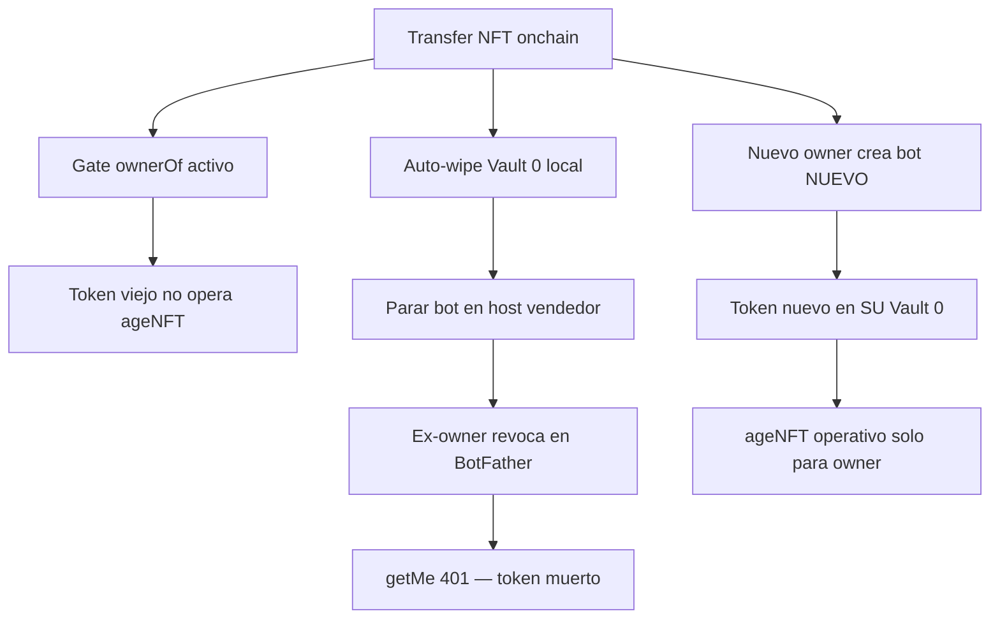

# Decisión — Seguridad al transferir: gateways, tokens y nuevo dueño

> **Estado:** Aprobado · **Fecha:** 2026-09-01  
> **Prioridad:** Privacidad y seguridad del usuario — **no dejar servicios abiertos** aunque el riesgo parezca remoto.  
> Complementa [`transfer-telegram-gateway.md`](transfer-telegram-gateway.md).

---

## Respuesta directa (FAQ producto)

| Pregunta | Respuesta |
|----------|-----------|
| ¿Nuevo dueño = bot nuevo? | **Sí, obligatorio.** Política `new-bot-only`. |
| ¿El token del ex-owner controla el ageNFT transferido? | **No.** El gate `ownerOf` lo bloquea aunque conserve el token. |
| ¿Queda entonces «inservible» para ageNFT? | **Sí** respecto al cuerpo transferido — no puede operar cerebro, TBA ni memoria del NFT. |
| ¿Puede seguir sirviendo para *algo*? | Solo en el **@handle antiguo** si no revocó — impostor o confusión, no el ageNFT real. |
| ¿Cómo dejarlo **totalmente** inservible? | Ex-owner **revoca** en @BotFather → `getMe` **401** → token muerto en Telegram. |
| ¿Reutilizar el mismo @handle? | **No.** Modo cooperativo descartado. |

**Regla de oro:** transferir NFT = cortar cables del vendedor + el comprador cablea los suyos desde cero.

---

## Tres capas de cierre (defensa en profundidad)

Ninguna capa sola basta; juntas cubren privacidad y superficie de ataque.

| Capa | Qué hace | ¿Inservible para ageNFT? | ¿Cierra @handle viejo? |
|------|----------|--------------------------|------------------------|
| **1. `ownerOf` gate** | Runtime rechaza turnos si wallet ≠ owner | ✅ Sí | — |
| **2. Bot nuevo (comprador)** | Token B ≠ token A; identidades Telegram distintas | ✅ Sí | ✅ El comprador no usa el handle del vendedor |
| **3. Revocar token A** | BotFather invalida token; probe `getMe` → 401 | ✅ Sí | ✅ Sí — nadie opera ese bot |



---

## Principio

**Transferir el ageNFT = cortar toda operación del ex-owner + el nuevo owner empieza con cables nuevos.**

- Núcleo compacto (NFT, TBA, soul, URUIRU) viaja onchain.
- **Vault 0** (tokens, keys, bots) **nunca** viaja y **debe quedar inservible o aislado** para el cuerpo transferido.
- **Nuevo dueño = bot/credencial nueva** — sin reutilizar el @handle ni el token del vendedor.

---

## ¿Se puede obligar onchain a revocar Telegram antes del transfer?

**No de forma trustless** con ERC-721 estándar:

- `safeTransferFrom` no conoce BotFather ni Vault 0.
- No hay oracle nativo que pruebe “token revocado” en Base.
- El vendedor siempre puede transferir directamente en un explorador **saltándose** un wizard.

**Sí podemos** (capas producto + runtime):

| Capa | Obligatoriedad | Efecto |
|------|----------------|--------|
| **`ownerOf` gate** | Técnica, activa | Ex-owner **no opera** el ageNFT aunque conserve token |
| **Wizard pre-transfer** | Proceso oficial | No marca “listo” hasta probe `getMe` → 401 |
| **Auto-wipe al detectar transfer** | Runtime | Borra Vault 0 local, para bot, `logOut` API |
| **Revocación BotFather** | Humana + verificada | Token **inservible** incluso para impostor en @handle viejo |
| **Nuevo owner: bot nuevo** | Política + wizard | Cable Telegram **independiente** del vendedor |

---

## Nuevo dueño = bot nuevo (sí, y es lo más limpio)

### Por qué basta con bot nuevo

| Actor | Bot | Token | ¿Puede operar el ageNFT transferido? |
|-------|-----|-------|--------------------------------------|
| Ex-owner | `@Unit1_agent_bot` (viejo) | Token A | **No** — `ownerOf` gate |
| Nuevo owner | `@SuBotNuevo` (nuevo) | Token B | **Sí** — si wallet = owner |

El token A **no controla** el bot B. Son identidades distintas en Telegram.

**Para el ageNFT el token viejo ya es inservible** gracias al gate — aunque no revoque.

### Riesgo remoto si **no** revoca (por eso insistimos)

Token A sigue vivo **solo** para `@Unit1_agent_bot`:

- Un impostor podría contestar en el **handle antiguo** (no es URUIRU/ageNFT real, pero confunde).
- Usuarios con enlace viejo escriben al @ equivocado.

**Revocar Token A** → `getMe` 401 → **totalmente inservible** incluso para eso.

**Política:** nuevo dueño **siempre** bot nuevo; ex-owner **siempre** revocar (checklist + probe en wizard).

---

## ¿Puede el ageNFT revocar el token solo?

| Acción | ¿Automatizable? |
|--------|----------------|
| Parar bot + borrar `agenft-telegram.env` | ✅ Sí, al detectar `Transfer` / fallo `ownerOf` |
| `logOut` / quitar webhook (Bot API) | ✅ Parcial — deja de operar en vuestro VPS |
| **Revocar token (BotFather `/revoke`)** | ❌ No vía API pública equivalente |

**Conclusión:** auto-desconexión agresiva en runtime + wizard que exige revocación verificada (401). No prometer “revoca solo el NFT”.

---

## Verificación: probe `getMe` (implementar)

```http
GET https://api.telegram.org/bot<TOKEN>/getMe
```

| Respuesta | Significado |
|-----------|-------------|
| **200 OK** | Token **vivo** — no cumple checklist de cierre |
| **401 Unauthorized** | Token **muerto** — OK para dar transfer por cerrado |

Script objetivo: `npm run gateway:verify-telegram -- --must-be-dead` (ex-owner)  
Nuevo owner: token nuevo debe dar **200** antes de arrancar bot.

---

## Flujos wizard (objetivo producto)

### A) Ex-owner — «Cerrar gateways antes de vender»

1. Detectar que eres `ownerOf` (wallet conectada).
2. **Parar** bot Telegram en este host (automático si transfer ya ocurrió).
3. Instrucción clara: **@BotFather → /revoke** (no reutilizar bot).
4. **Probe** hasta `getMe` → 401.
5. Opcional: export memoria según política venta.
6. Solo entonces: «Firmar transfer» (UX; no bloquea tx onchain pura).

### B) Nuevo owner — «Activar mi ageNFT»

1. Wallet = `ownerOf`.
2. Ver TBA + saldo.
3. **Crear bot NUEVO** en BotFather (texto explícito: *no uses el bot del vendedor*).
4. Pegar token → Vault 0 local.
5. `AGENFT_OPERATOR_ADDRESS` = tu wallet.
6. `npm run owner:gate` + `gateway:verify-telegram` (200).
7. Arrancar runtime + prueba mensaje.

---

## Inventario Vault 0 — versión ambiciosa (revocar / rotar al transferir)

Todo lo siguiente **permanece con el ex-owner** si no se corta; **nunca** debe seguir ligado al ageNFT transferido.

| Órgano / gateway | Secretos | Acción al transferir |
|------------------|----------|----------------------|
| **Telegram** | Bot token | **Revocar** + bot **nuevo** comprador |
| **Matrix** | Access token, device | Logout; bot `@…` nuevo |
| **Discord** | Bot token | Reset en Developer Portal |
| **Nostr** | nsec, bunker | Rotar; no reutilizar |
| **WhatsApp / Simplex** | API keys | Desvincular proveedor |
| **Cerebro hose (E)** | OpenRouter, OpenAI, Anthropic… | Borrar keys runtime |
| **Memoria** | toju, Pinata, W3Stor | Revocar API keys; IPFS según política |
| **Voz / presencia** | ElevenLabs, dTelecom, Livepeer | Revocar keys |
| **Hosting** | SSH, Akash, deploy keys | Apagar instancias vendedor |
| **Webhooks** | URLs + secrets | Invalidar |
| **OAuth** | Google, GitHub refresh | Desconectar apps |
| **x402 / TBA** | Session keys, allowances | Nuevo owner firma de nuevo |
| **Notificaciones** | SMTP, push | Dejar de usar |

**Regla:** Vault 0 **nunca** en manifiesto onchain / IPFS público.

---

## Política manifiesto (`ageNFT/v1`)

```json
{
  "transfer": {
    "vault0NeverTravels": true,
    "transferEndsBotAccess": true,
    "gateways": {
      "telegram": {
        "policy": "new-bot-only",
        "exOwnerMustRevoke": true,
        "verifyDeadTokenVia": "telegram-getMe-401"
      }
    },
    "runtimeGate": {
      "requireOwnerOfMatch": true,
      "onMismatch": "dormant_refuse_turns",
      "onTransferDetected": "wipe-vault0-and-stop-gateways"
    }
  }
}
```

---

## Modos descartados (recordatorio)

| Modo | Estado |
|------|--------|
| Cooperativo — mismo @handle BotFather | ❌ Descartado |
| Reutilizar token Telegram | ❌ Prohibido |
| Token en manifiesto | ❌ Prohibido |

---

## Implementación — orden

| # | Entregable | Estado |
|---|------------|--------|
| 1 | `owner-gate.mjs` | ✅ |
| 2 | Decisión Telegram + esta doc | ✅ |
| 3 | `gateway:verify-telegram.mjs` (getMe vivo/muerto) | ⏳ |
| 4 | Listener `Transfer` → wipe Vault 0 + stop bot | ⏳ |
| 5 | Wizard dashboard pre/post transfer | ⏳ |
| 6 | Misma plantilla para Matrix, Discord… | ⏳ Fase posterior |

---

## Mensajes usuario (copy fijo)

**Ex-owner:**  
«Al vender tu ageNFT debes **revocar** el bot en @BotFather. El comprador creará **su propio bot**. Tu token no controlará su agente, pero si no revocas alguien podría usar tu @handle antiguo.»

**Nuevo owner:**  
«Crea un **bot nuevo** en @BotFather. **No** uses el bot del vendedor. Conecta **tu** wallet — es la dueña del NFT.»

---

## Docs relacionados

- [`transfer-telegram-gateway.md`](transfer-telegram-gateway.md)
- [`memory-transfer-policy.md`](../research/memory-transfer-policy.md)
- [`transfer-local-hosting.md`](../research/transfer-local-hosting.md)
- [`dapp/transfer.html`](../../dapp/transfer.html)
