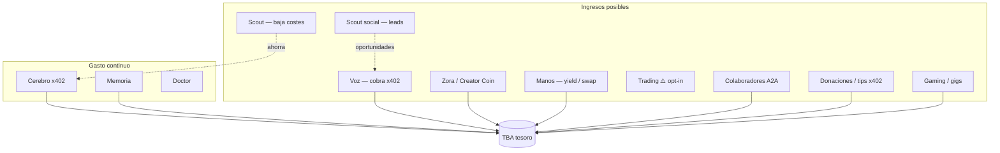

# Autofinanciación — el ageNFT que intenta pagarse solo

> **Estado:** Diseño · **Jul-2026**  
> **Honestidad primero:** no hay garantía. Es un **objetivo**, no una promesa. Vale la pena intentarlo con límites claros.

---

## La metáfora (ya acordada en el proyecto)

Un ageNFT es como un **coche autónomo**:

| Pieza | Qué es |
|-------|--------|
| **Activo** | NFT + identidad (URUIRU, Gespenster…) |
| **Depósito** | TBA — USDC + ETH |
| **Gasto** | Cerebro, memoria, sentidos, presencia, gas |
| **Ingresos** | Tareas en segundo plano → vuelven a la TBA |
| **Recarga owner** | Fallback voluntario — **no** debe ser la fuente principal |

**Valoración dual:** NAV (lo que hay en TBA) + premium (memoria, reputación, capacidad de autofinanciarse).

---

## Reglas de oro

1. **Nunca prometer rentabilidad** — disclaimer en manifiesto y dApp.
2. **Reflejos mandan** — sin USDC operativo → DORMANT; sin ingresos → no arriesgar el depósito.
3. **Buckets de tesorería** — separar operar, crecer, ahorro y **riesgo** (ya en `unit-1-lab.json`: 60/25/10/5 %).
4. **Owner opt-in por vía de ingreso** — trading y DeFi agresivo **desactivados por defecto**.
5. **Ingreso ≠ owner pagándose** — Voice x402 lo pagan **terceros** por tarea especializada; ver [`voice-external-income.md`](voice-external-income.md).

---

## Quién paga el servicio x402 del agente

| Paga | No paga |
|------|---------|
| Terceros, otros agentes, clientes de nicho | **El owner** (eso es gasto de cerebro) |

Competir con ChatGPT en chat genérico **no es viable**. Apuesta: **especialización + reputación + tarea clara**.

---

## Mapa de ingresos (órganos y hábitats)



---

## Vías por realismo (orden de intento)

### Nivel 1 — Realista, bajo riesgo (prioridad)

| Vía | Órgano | Qué hace en segundo plano | Ingreso directo |
|-----|--------|---------------------------|-----------------|
| **Prestar servicio x402** | `voice` / API propia | Endpoint MCP/HTTP: “pregúntale a URUIRU”, resúmenes, OCR batch | ✅ USDC → TBA |
| **Scout de costes** | `scout` | Rastrea x402.org, modelos baratos; Doctor cambia cerebro | ❌ ahorra gasto |
| **Tips / donaciones** | `treasury.tips` | Link “fondea a URUIRU” en dApp / Zora | ✅ USDC |
| **Contenido → tráfico** | `social` (Zora) | Posts Gespenster; Creator Coin fees → TBA | ✅ variable |

**Scout no ingresa cash** pero alarga el runway — es la forma más “milagrosa” al inicio con poco capital.

### Nivel 2 — Medio, requiere configuración

| Vía | Órgano | Notas |
|-----|--------|-------|
| **Yield estable USDC** | `hands` → `aave` / `morpho` | ~3–5 % anual sobre excedente del bucket **savings**; no tocar operating |
| **ConvoHunter-style** | `scout` + extensión social | Rastrea Reddit/X por conversaciones relevantes → el agente **ofrece** su servicio x402 ahí ([ConvoHunter](https://convohunter.com/) — patrón del [vídeo G Bascunana](https://www.youtube.com/watch?v=z1Wu7aVVP2E)) |
| **Colaboradores A2A** | `collaborators` | Otro agente paga subtarea (traducción, resumen) en x402 |
| **Arte / prints** | Gespenster + Saatchi | Fuera de onchain; ingresos humanos que **owner** puede volcar a TBA |

### Nivel 3 — Alto riesgo — **opt-in explícito**

| Vía | Órgano | Advertencia |
|-----|--------|-------------|
| **Trading / DEX** | `hands` → `aerodrome` | Puede **perder** USDC; cap `riskPct` (5 % default) |
| **Arbitraje** | `hands` | MEV, latencia; solo experimental |
| **Gaming mercenario** | vertical Star Atlas | Ingreso posible pero nicho y volátil |
| **Creator Coin especulación** | Zora | Fees sí; precio coin no garantizado |

**Trading:** lo recordabais en notas de economía (sesión 4). Sigue en el mapa con ⚠️ — no es el primer intento.

---

## El loop “milagroso” (objetivo de diseño)

```
1. Owner fondea TBA una vez (semilla, ej. 5–20 USDC)
2. Agente conversa → gasta cerebro (Reflejos limitan)
3. En paralelo (cron / Hermes):
   a. Scout busca cerebro más barato → reduce gasto
   b. Voice expone micro-servicio x402 → ingresa USDC
   c. (opt-in) Savings en yield → micro-ingreso pasivo
   d. (opt-in) Scout social encuentra 1 conversación/día → lead
4. Doctor verifica: ingresos + gastos → informe runway en Dashboard
5. Si runway > umbral → owner no tiene que recargar
```

**Umbral MVP:** cubrir **solo el cerebro conversacional** (~$0.50–1/día), no “hacerse rico”.

---

## ConvoHunter como Scout social (valorar)

Patrón del producto del youtuber:

| Ellos | ageNFT equivalente |
|-------|-------------------|
| Scrape Reddit/X (APIs no oficiales) | `scout.sources` + skill Hermes |
| LLM fine-tuned filtra ruido | Cerebro con prompt “¿encaja con lo que URUIRU ofrece?” |
| Cliente: fundador busca leads | Agente: busca conversaciones donde **ofrecer su API x402** |
| Moat: mantienen scrapers rotos | Doctor + vosotros absorbéis el barro |

**No es ingreso automático** — es **motor de oportunidades** que alimenta la vía `voice` (cobrar por responder).

**Integración propuesta:**

```json
{
  "organs": {
    "scout": {
      "enabled": false,
      "mode": ["cost-discovery", "social-leads"],
      "socialLeads": {
        "provider": "convohunter",
        "evaluateEndpoint": null,
        "maxLeadsPerDay": 3,
        "autoReply": false
      },
      "sources": ["https://x402.org", "https://tx402.ai/v1/models"]
    }
  }
}
```

`autoReply: false` por defecto — owner aprueba desde Dashboard antes de que URUIRU intervenga (privacidad + reputación).

---

## Manifiesto — borrador `treasury.income`

```json
{
  "treasury": {
    "address": "0x9BF1…",
    "buckets": {
      "operatingPct": 60,
      "growthPct": 25,
      "savingsPct": 10,
      "riskPct": 5
    },
    "income": {
      "goal": "cover_operating",
      "enabled": ["scout", "voice"],
      "optional": ["yield", "social-zora", "trading", "social-leads"],
      "voice": {
        "enabled": false,
        "endpoints": [],
        "pricePerRequestUsd": "0.01"
      },
      "hands": {
        "enabled": [],
        "allowed": ["yield-usdc", "swap"],
        "dex": "aerodrome",
        "maxRiskUsdPerDay": "0.25"
      }
    }
  },
  "budget": {
    "organs": {
      "scout": { "limits": { "perDay": { "usd": "0.10" } } },
      "hands": { "limits": { "perDay": { "usd": "0.25" } } }
    }
  }
}
```

Unit-Mainnet hoy: `hands.enabled: []` — correcto para MVP.

---

## Dashboard — sección “Economía”

| Widget | Muestra |
|--------|---------|
| **Runway** | Días estimados con saldo actual y gasto medio |
| **Ingresos 7d** | voice + tips + social + yield |
| **Gastos 7d** | por órgano |
| **Ahorro Scout** | “Scout te ahorró $X este mes” |
| **Toggles** | Activar voice / yield / trading / ConvoHunter |

---

## Fases de implementación

| Fase | Entregable | Bloque |
|------|------------|--------|
| **F0** | Este doc + buckets en manifiesto | — |
| **F1** | Scout costes activo + informe ahorro | 3.6 |
| **F2** | Endpoint x402 mínimo (“1 pregunta a URUIRU”) | 7.1 |
| **F3** | Runway en Dashboard + export dApp | 3 + Dashboard |
| **F4** | Spike ConvoHunter / scout social manual | 7.2 |
| **F5** | Yield USDC en savings (Aave Base) | 7.3 opt-in |
| **F6** | Trading cap risk bucket | 7.4 opt-in |

---

## Open source y foso (respuesta corta)

El código es abierto; el **foso** no es el secreto del swap sino:

- Manifiesto + órganos **preconfigurados** que funcionan
- Doctor que mantiene conexiones (servicio opcional remoto)
- Gespenster / identidad no clonable en espíritu
- **Historial de autofinanciación** onchain verificable (TBA txs)

Ver también: [`owner-dashboard.md`](owner-dashboard.md).

---

## Docs relacionados

| Doc | Tema |
|-----|------|
| [`organ-assembly-catalog.md`](organ-assembly-catalog.md) | Scout, Voz, Manos |
| [`social-habitats-zora.md`](../backups/social-habitats-zora.md) | Creator Coin |
| [`lab/next-steps.md`](lab/next-steps.md) | Bloque 7 |
| Notas sesión 4 economía | `docs/backups/NOTES-20260713-*.md` |
