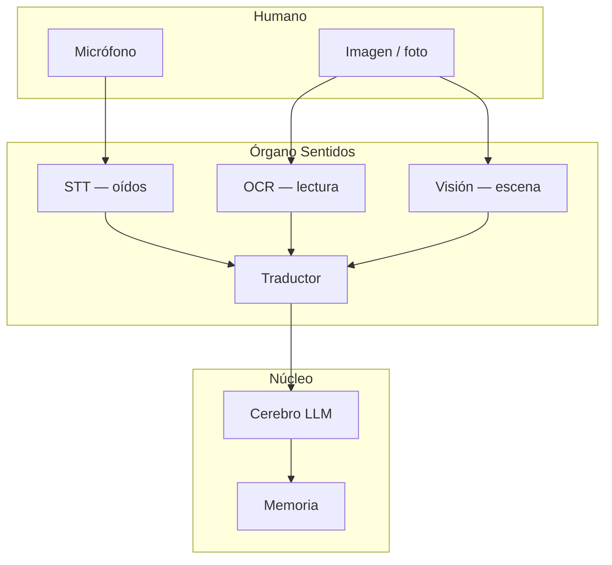

# Órgano Sentidos — escucha, visión, traducción

> **Estado:** Decisión de diseño · **Jul-2026**  
> Complementa [`presence-voice-stack.md`](../backups/presence-voice-stack.md) (TTS / habla) y [`organ-assembly-catalog.md`](organ-assembly-catalog.md).

---

## Principio

Un ageNFT **no solo habla y piensa** — también **escucha** y **ve**.

| Canal humano | Entrada | Órgano ageNFT | Salida hacia cerebro |
|--------------|---------|---------------|----------------------|
| Voz | Audio micrófono | **Oídos** (STT) | Texto transcrito |
| Idioma distinto | Texto/audio en otro idioma | **Traductor** | Texto en idioma del agente |
| Imagen | Foto, captura, NFT | **Ojos** (visión) | Descripción + objetos + contexto |
| Texto en imagen | Cartel, documento, meme | **OCR** | Texto plano extraído |

Todo debe poder pagarse desde la **TBA** (x402), con **fallbacks** en manifiesto y caps en Reflejos — igual que el cerebro.

---

## Mapa en el cuerpo digital



**Presencia** (TTS + cara URUIRU) es la salida; **Sentidos** es la entrada simétrica.

---

## Sub-órganos (borrador manifiesto)

Propuesta de bloque `organs.senses` (schema v1 — pendiente formalizar):

```json
{
  "organs": {
    "senses": {
      "enabled": true,
      "hearing": {
        "stt": {
          "primary": {
            "provider": "dtelecom-x402",
            "endpoint": "https://x402.dtelecom.org/v1/stt",
            "network": "eip155:8453",
            "languages": ["es", "en", "auto"]
          },
          "fallbacks": []
        }
      },
      "vision": {
        "describe": {
          "primary": {
            "provider": "tx402.ai",
            "endpoint": "https://tx402.ai/v1/chat/completions",
            "model": "vision-capable",
            "network": "eip155:8453"
          },
          "fallbacks": []
        },
        "ocr": {
          "primary": {
            "provider": "dtelecom-x402",
            "endpoint": "https://x402.dtelecom.org/v1/ocr",
            "network": "eip155:8453"
          },
          "fallbacks": []
        }
      },
      "translation": {
        "primary": {
          "provider": "brain-inline",
          "note": "El cerebro traduce si el STT/OCR devuelve otro idioma; opcional servicio dedicado"
        },
        "fallbacks": [
          { "provider": "dtelecom-x402", "endpoint": "https://x402.dtelecom.org/v1/translate" }
        ]
      }
    }
  }
}
```

Presupuesto sugerido: `budget.organs.senses` con caps diarios separados de `brain` (STT/OCR suelen cobrar por minuto o por imagen).

---

## Servicios candidatos (agente-soberano)

### Oídos — STT (voz → texto)

| Servicio | Precio orient. | ES | x402 / TBA | Notas |
|----------|----------------|-----|------------|-------|
| **[dTelecom x402](https://x402.dtelecom.org/)** | ~$/min STT | ✅ | ✅ Base USDC | Mismo stack que TTS; coherente con presencia |
| **kas402** | por llamada | ✅ | ✅ | Proxy multi-proveedor |
| **Whisper self-host** | compute GPU | ✅ | N/A (self-host) | Privacidad máxima; TBA paga Akash/io.net |
| OpenAI Whisper API | por min | ✅ | ❌ cuenta | Solo vía proxy x402 |

### Ojos — visión (imagen → significado)

| Servicio | Qué hace | x402 / TBA | Notas |
|----------|----------|------------|-------|
| **LLM multimodal** (tx402.ai, etc.) | Describe escena, objetos, tono | ✅ | Enviar imagen base64 + prompt |
| **LLaVA / Qwen-VL self-host** | Mismo, local | Self-host | Doctor puede failover |
| **Google Vision / AWS Rekognition** | Etiquetas | ❌ cuenta | Descartado MVP |

### Lectura — OCR (imagen → texto)

| Servicio | x402 / TBA | Notas |
|----------|------------|-------|
| **dTelecom OCR** (si expuesto) | ✅ | Unificar con STT en mismo gateway |
| **Tesseract self-host** | Self-host | Gratis; calidad menor en manuscrito |
| **LLM vision + prompt OCR** | ✅ | “Transcribe solo el texto visible” — más caro pero flexible |
| **Google Document AI** | ❌ | No soberano |

### Traductor

| Enfoque | Cuándo |
|---------|--------|
| **Inline en cerebro** | MVP — “Responde en español; entrada puede venir en inglés” |
| **Servicio x402 dedicado** | Latencia baja, muchos idiomas, facturación separada |
| **Antes del cerebro** | Normalizar todo a `manifest.runtime.defaultLocale` |

---

## Flujo por gateway

| Gateway | Entrada soportada | Sentidos activos |
|---------|-------------------|------------------|
| **Telegram** | Texto ✅ · Voz (nota de voz) ⏳ · Foto ⏳ | STT + vision + OCR |
| **dApp web** | Texto ⏳ · Mic ⏳ · Upload imagen ⏳ | Todos |
| **Hermes CLI** | Texto ✅ · archivos ⏳ | OCR + vision |

Telegram ya entrega `voice` y `photo` en la API — el bot debe descargar el archivo, pasarlo a Sentidos, inyectar el texto en `runTurn`.

---

## Privacidad y Reflejos

- Audio e imágenes del usuario **no** se guardan en manifiesto onchain.
- Memoria: solo **resumen** acordado (L0/L1), no el blob raw salvo opt-in del owner.
- Reflejos: límite `requests` y `usd` por `senses` para evitar spam de imágenes enormes.
- Tamaño máximo de upload por gateway (ej. 5 MB foto, 60 s audio).

---

## Fases de implementación

| Fase | Entregable | Bloque roadmap |
|------|------------|----------------|
| **S0** | Este doc + catálogo órganos | — |
| **S1** | OCR vía LLM vision | Bloque 5 |
| **S2** | STT x402 | Bloque 5 |
| **S3** | Traducción + `defaultLocale` | Bloque 5 |
| **S4** | dApp mic + upload | Bloque 3 + Dashboard |
| **S5** | Doctor failover | Bloque 3 paso 6 |

Configuración ON/OFF y caps: **Dashboard** — [`owner-dashboard.md`](owner-dashboard.md).

---

## Relación con URUIRU / Gespenster

- **Escuchar** no cambia la estética; **ver** puede alimentar respuestas sobre arte (“esto parece un Gespenster Z…”).
- OCR útil en exposiciones: fotografiar ficha del museo → el agente comenta en contexto.
- Voz + TTS cierran el círculo: conversación hablada con un Gespenster onchain.

---

## Docs relacionados

| Doc | Tema |
|-----|------|
| [`organ-assembly-catalog.md`](organ-assembly-catalog.md) | Catálogo y sustitutos |
| [`presence-voice-stack.md`](../backups/presence-voice-stack.md) | TTS / habla (salida) |
| [`lab/next-steps.md`](lab/next-steps.md) | Bloque 4 — Sentidos + Presencia |
| [`presence-context-layers.md`](../backups/presence-context-layers.md) | Qué ve el usuario por hábitat |
