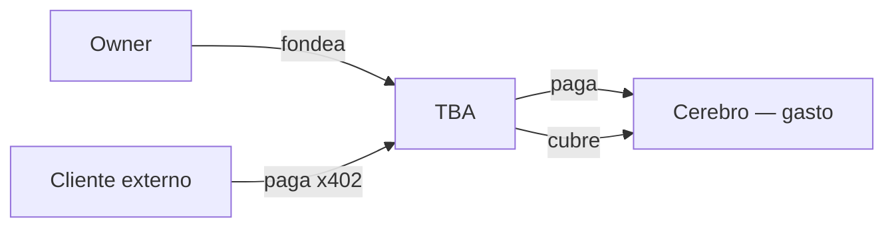

# Ingresos x402 — quién paga y por qué

> **Estado:** Decisión de diseño · **Jul-2026**  
> Aclaración crítica sobre el órgano **Voice** / servicios cobrados.

---

## Quién NO paga

| Actor | Por qué no |
|-------|------------|
| **Owner del NFT** | No tiene sentido pagar USDC a su propia TBA para que URUIRU le responda en Telegram — eso es **gasto operativo** (cerebro), no ingreso. |
| **El propio agente** | La TBA no se paga a sí misma en círculo — contabilidad incorrecta. |

El owner **fondea** la TBA (semilla, recarga voluntaria). Eso va a **gastos**, no a la línea “ingresos x402”.

---

## Quién SÍ paga (clientes externos)

| Actor | Caso |
|-------|------|
| **Terceros** | Desconocidos que usan el endpoint público del agente |
| **Otros agentes** | A2A / MCP — pago x402 por subtarea |
| **Usuarios de nicho** | Necesitan una **tarea muy específica** donde el agente es claramente mejor |
| **“Alquiler” puntual** | Acceso temporal al ageNFT para un trabajo (informe, OCR lote, moderación, curaduría Gespenster…) |

---

## Por qué es difícil hoy (honestidad)

Con ChatGPT, Claude, Gemini en suscripción, **casi nadie paga $0.01** por un chat genérico.

**Solo tiene sentido si:**

1. **Especialización clara** — el agente hace *una cosa* mejor que un LLM general  
2. **Valor visible** — demo, portfolio, reputación onchain  
3. **Soberanía / datos** — el cliente no quiere meter su prompt en OpenAI  
4. **Paquete transferible** — compra acceso al “cuerpo” completo, no solo API  
5. **Precio por tarea** — más barato que contratar a un humano para *esa* tarea  

---

## Cómo convencer (estrategias realistas)

| Estrategia | Qué es | ageNFT |
|------------|--------|--------|
| **Nicho extremo** | “Solo Gespenster / arte xilográfura / curaduría” | URUIRU + Ety Fefer |
| **Reputación verificable** | Scores ERC-8004, historial txs TBA | Manifiesto + explorer |
| **Precio transparente** | Sabes exacto qué cuesta antes | x402 + Dashboard público |
| **Prueba gratis** | 1ª consulta probe o tier G | Scout + demo |
| **Comparación honesta** | “No somos ChatGPT; somos X” | Landing clara |
| **B2B agente-a-agente** | Otro bot paga OCR batch | Colaboradores |
| **Contenido → autoridad** | Zora, exposiciones → confianza | Gespenster link |

**No competir en “chat barato general”.** Competir en **“la mejor herramienta para esta tarea concreta”**.

---

## Tipos de oferta externa (manifiesto `voice`)

| Modo | Descripción |
|------|-------------|
| `api-per-request` | HTTP/MCP x402 por llamada |
| `task-fixed` | Precio fijo por trabajo acotado (ej. “OCR 10 imágenes”) |
| `rental-window` | Acceso N horas — session key temporal |
| `collaborator-only` | Solo agentes en `trusted[]` |

`rental-window` encaja con “alquilar el ageNFT” sin transferir el NFT.

---

## Relación con autofinanciación

Voice x402 es **una vía** del Bloque 7 — **secundaria** y dependiente de especialización.

Prioridad realista de ingresos:

1. Scout (ahorro) — no es ingreso pero alarga vida  
2. Tips / donaciones  
3. Tareas B2B / agentes  
4. Voice externo especializado  
5. Zora / social  
6. Yield / trading  

Ver [`self-funding.md`](self-funding.md).

---

## Dashboard

- Sección **“Ofrecer servicio”** — solo owner; define precio, tareas, quién puede llamar.  
- Separar **“Mis gastos”** (owner usa el agente) vs **“Ingresos externos”** (terceros pagan).
