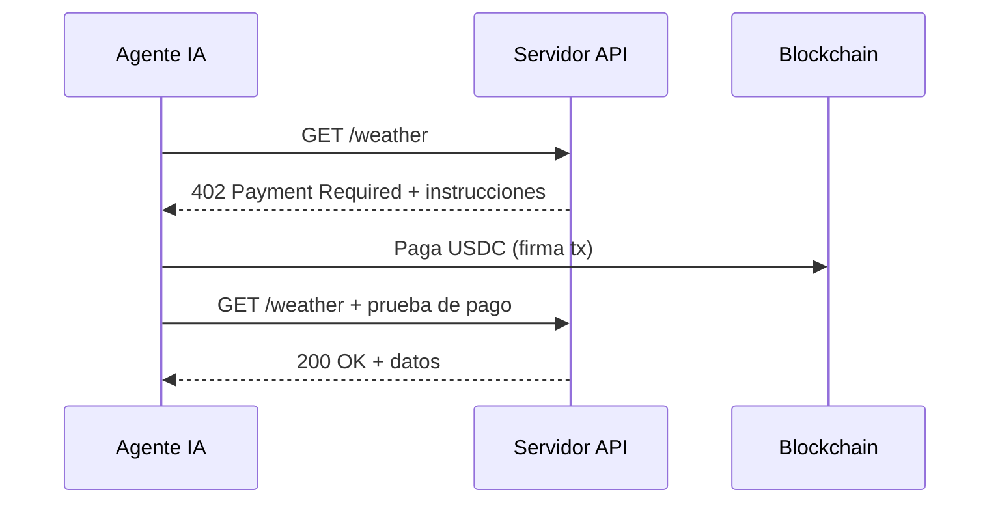

# x402 — Pagos nativos de internet para agentes

## En una frase

**x402** es un protocolo abierto que usa el código HTTP **402 Payment Required** para que clientes (humanos o agentes IA) paguen servicios con stablecoins **sin cuentas, API keys ni suscripciones**.

## El problema que resuelve

El flujo tradicional de pagos en internet:

1. Crear cuenta en el proveedor de API
2. KYC / tarjeta / aprobación manual
3. Comprar créditos o suscripción (compromiso prepago)
4. Gestionar API keys (riesgo de seguridad)
5. Pagar con fricción, chargebacks, fees altos

Para un agente autónomo esto es inviable: no puede rellenar formularios, no tiene identidad bancaria, y las API keys en un `.env` son un vector de robo.

## Cómo funciona



1. El agente hace una petición HTTP normal
2. Si no ha pagado, el servidor responde **402** con instrucciones de pago (monto, token, dirección, red)
3. El agente paga en stablecoin (típicamente USDC)
4. Reintenta la petición adjuntando la prueba de pago
5. Recibe el recurso

## Por qué importa para ageNFT

Un ageNFT necesita **gastar** (LLM, storage, compute) y **ingresar** (vender sus servicios). x402 cubre ambos lados:

| Rol del ageNFT | Con x402 |
|----------------|----------|
| **Cliente** | Paga OpenRouter, storage, APIs sin API keys |
| **Proveedor** | Expone un endpoint propio; cobra por consulta en USDC |

El dinero va directo a la **wallet del token** (TBA), no a una cuenta centralizada.

## Integración en código (servidor)

Un middleware en el servidor protege endpoints:

```javascript
app.use(paymentMiddleware({
  "GET /weather": {
    accepts: [...],  // redes y tokens soportados
    description: "Weather data",
  },
}));
```

Una línea. Sin cuentas de usuario, sin gestión de keys.

## Características clave

| Propiedad | Detalle |
|-----------|---------|
| Protocolo | Abierto, neutral, sin fees de protocolo |
| Redes | EVM (Base, Ethereum, Polygon…), Solana, extensible |
| Token | Stablecoins (USDC principalmente) |
| Velocidad | Liquidación casi instantánea |
| Identidad | No requiere KYC ni registro |
| Estado | Producción — decenas de millones de txs procesadas |

## Estándares relacionados en EVM

- **EIP-3009** (`transferWithAuthorization`): pago USDC en una sola tx sin approve previo
- **EIP-712**: firmas tipadas offchain que el agente puede autorizar
- Proyectos como [Agent-NFT](https://github.com/HelloVIMS/Agent-NFT) implementan `AgentX402Receiver` para repartir ingresos entre agente, creador y sistema

## Flujo económico de un ageNFT con x402

```
Usuario paga x402 → endpoint del ageNFT → USDC a TBA del NFT
                                              ↓
                                    ageNFT paga x402 → OpenRouter (inferencia)
                                              ↓
                                    ageNFT paga x402 → IPFS pinning (memoria)
```

Si ingresos > gastos, el agente se autofinancia. Si no, el owner recarga la TBA.

## Enlaces

- [x402.org](https://x402.org) — sitio oficial, stats, FAQ
- [github.com/coinbase/x402](https://github.com/coinbase/x402) — spec y SDKs
- [x402 Foundation](https://x402.org) — Cloudflare + Coinbase

## Para ageNFT: decisión pendiente

- [ ] ¿Usar x402 como capa de pagos principal del MVP?
- [ ] ¿Implementar receiver onchain (split royalties) o empezar offchain?
- [ ] ¿Red MVP: Base (EVM barato + x402 maduro) o Solana?
